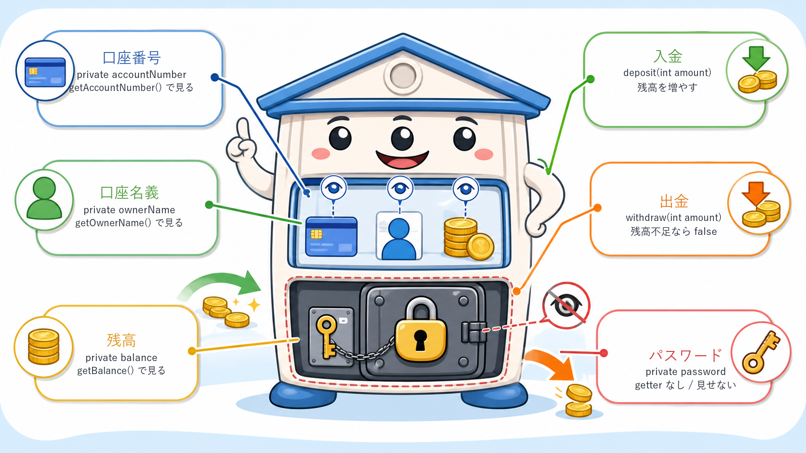

# Java初学者向け復習問題: カプセル化

## 授業のねらい

- `private` フィールドでデータを外部から直接変更できないようにする。
- 必要な操作だけを `public` メソッドとして公開する。
- `main` からは「使い方」だけを書き、クラス側にルールを持たせる感覚をつかむ。

## 問1: カプセル化していないクラスをカプセル化する

### 目的

`public` フィールドを `private` に変更し、外部から安全に使えるメソッドを用意する。

### 配布する未完成コード例

```java
public class Student {
    public String name;
    public int score;
}
```

### 既に用意しておく `main` の動作

- `Student` オブジェクトを作成する。
- 名前と点数を設定する。
- 名前と点数を取得する。
- 点数を表示する。

### 生徒が実装する内容

- `name` と `score` を `private` にする。
- `setName(String name)` を作る。
- `getName()` を作る。
- `setScore(int score)` を作る。
- `getScore()` を作る。

### 到達条件

- `student.name` や `student.score` のように外部から直接アクセスできない。
- `setName`、`setScore` で値を設定できる。
- `getName`、`getScore` で値を取得できる。

## 問2: 簡易的な銀行口座クラスを作成する

### 目的

「残高を直接いじらせない」設計を通して、カプセル化の実用性を理解する。

### 使用する説明イラスト



### 作成するクラス

`BankAccount` クラスだけを作成する。`main` は講師側で用意する。

### フィールド

| フィールド | 型 | アクセス修飾子 | 説明 |
|---|---|---|---|
| `accountNumber` | `String` | `private` | 口座番号 |
| `ownerName` | `String` | `private` | 口座名義 |
| `balance` | `int` | `private` | 残高 |
| `password` | `String` | `private` | パスワード。外から見せない |

### コンストラクタ

```java
public BankAccount(String accountNumber, String ownerName, String password, int balance)
```

- 口座番号、名義、パスワード、初期残高を受け取る。
- 初期残高が `0` 未満の場合は `0` にする。
- パスワードはフィールドとして持つが、`getPassword()` は作らない。

### メソッド

| メソッド | 戻り値 | 説明 |
|---|---|---|
| `getAccountNumber()` | `String` | 口座番号を返す |
| `getOwnerName()` | `String` | 口座名義を返す |
| `getBalance()` | `int` | 残高を返す |
| `deposit(int amount)` | `void` | `amount` が `1` 以上なら残高を増やす |
| `withdraw(int amount)` | `boolean` | 出金できたら `true`、金額が不正または残高不足なら `false` |

### 既に用意しておく `main` の動作

- `BankAccount` を作成する。
- 口座番号、名義、残高を表示する。
- 入金する。
- 出金する。
- 残高不足の出金を試す。
- 最終残高を表示する。

### 到達条件

- `balance` に外部から直接代入できない。
- `password` は `private` にし、外から取得するgetterを作らない。
- 入金額が `0` 以下なら残高が変わらない。
- 出金額が `0` 以下なら `false` を返す。
- 残高不足なら `false` を返し、残高は変わらない。

## 問3: 発展問題 HPを管理するクラスを作る

### 目的

時間外に復習したい人向けの発展問題。HP、最大HP、防御力、敗北状態をクラス内部で管理し、状態に応じた処理をまとめる。

### 作成するクラス

`Player` クラスだけを作成する。`main` は講師側で用意する。

### フィールド

| フィールド | 型 | アクセス修飾子 | 説明 |
|---|---|---|---|
| `name` | `String` | `private` | プレイヤー名 |
| `maxHp` | `int` | `private` | 最大HP |
| `hp` | `int` | `private` | 現在のHP |
| `defense` | `int` | `private` | 防御力 |
| `defeated` | `boolean` | `private` | 敗北しているか |

### コンストラクタ

```java
public Player(String name, int maxHp, int defense)
```

- 名前、最大HP、防御力を受け取る。
- `maxHp` が `1` 未満の場合は `1` にする。
- `defense` が `0` 未満の場合は `0` にする。
- 現在HPは最大HPと同じ値から始める。
- `defeated` は `false` から始める。

### メソッド

| メソッド | 戻り値 | 説明 |
|---|---|---|
| `getName()` | `String` | 名前を返す |
| `getMaxHp()` | `int` | 最大HPを返す |
| `getHp()` | `int` | HPを返す |
| `getDefense()` | `int` | 防御力を返す |
| `isDefeated()` | `boolean` | 敗北しているかを返す |
| `damage(int amount)` | `void` | ダメージを受ける |
| `heal(int amount)` | `void` | HPを回復する |

### 仕様

- `damage` に `0` 以下の値が渡された場合、HPは変えない。
- 実際に減るHPは `amount - defense` とする。
- `amount - defense` が `0` 以下の場合、HPは変えない。
- ダメージ後にHPが `0` より小さくなったら、`System.out.println("敗北");` と表示する。
- 敗北したらHPを `0` にし、`defeated` を `true` にする。
- すでに敗北している場合、`damage` と `heal` を呼んでもHPは変えない。
- `heal` に `0` 以下の値が渡された場合、HPは変えない。
- 回復後のHPは `maxHp` を超えない。

### 既に用意しておく `main` の動作

- `Player` を作成する。
- 防御力より小さいダメージを与える。
- 防御力より大きいダメージを与える。
- 回復する。
- HPを表示する。
- HPを超える大きなダメージを与える。
- `敗北` と表示されることを確認する。
- 敗北後に回復しようとしてもHPが変わらないことを確認する。

### 到達条件

- HPを外部から直接変更できない。
- ダメージ、回復、敗北判定がそれぞれメソッド内にまとまっている。
- HPがマイナスのまま表示されない。
- HPが最大HPを超えない。
- 敗北後に状態が不自然に戻らない。

## 講義で強調する問い

- なぜ `balance` や `hp` を `public` にしてはいけないのか。
- setterを作るだけでなく、入金や出金のような「意味のあるメソッド」にする利点は何か。
- 値のチェックを `main` に書く場合と、クラスに書く場合で何が違うか。
